# Архитектура в схемах

> **Что это.** Человеческий слой поверх `docs/`: как всё устроено и как связано —
> картинками, а не списком полей. Читается сверху вниз, без открывания кода.
>
> **Что это НЕ.** Не контракт и не источник правды. Точные поля, типы, ограничения и
> индексы — только в [DATA_MODEL.md](DATA_MODEL.md); поведение — в профильных файлах
> ([AUTH.md](AUTH.md), [ROOMS.md](ROOMS.md), [MESSAGES.md](MESSAGES.md),
> [FILES.md](FILES.md), [KB.md](KB.md), [TASKS.md](TASKS.md), [DYNAMICS.md](DYNAMICS.md),
> [NOTIFICATIONS.md](NOTIFICATIONS.md), [CABIN.md](CABIN.md), [SURVEY.md](SURVEY.md),
> [SUPPORT.md](SUPPORT.md), [CALENDAR.md](CALENDAR.md), [DEPLOY.md](DEPLOY.md),
> [TELEGRAM_BOT.md](TELEGRAM_BOT.md), [INTAKE_BOT.md](INTAKE_BOT.md),
> [ARGONAUTS.md](ARGONAUTS.md), [EXPEDITION.md](EXPEDITION.md),
> [GENE_KEYS.md](GENE_KEYS.md)). Здесь — только PK/FK и смыслообразующие поля, чтобы
> схема читалась.
>
> Схемы — текст (Mermaid) рядом с кодом: они живут в git, ревьюятся диффом и правятся
> в той же задаче, что и код. См. «[Как это поддерживать](#как-это-поддерживать)».

---

## 1. Стек

Наружу торчит **только nginx**. Postgres / Redis / MinIO host-портов не имеют и общие
для обоих цветов blue-green. Байты медиа **не проходят через FastAPI**: клиент ходит в
MinIO по presigned-URL, nginx лишь проксирует (кроме офлайн-бэкфилла старых видео —
`generate_video_poster` в `app/services/media.py` тянет оригинал на backend, это
осознанное нарушение принципа для разового прогона на старых записях, не хот-пас).

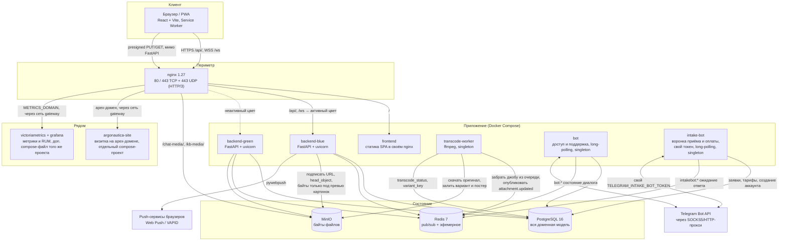
```mermaid
flowchart TB
    subgraph client["Клиент"]
        PWA["Браузер / PWA<br/>React + Vite, Service Worker"]
    end

    subgraph edge["Периметр"]
        NG["nginx 1.27<br/>80 / 443 TCP + 443 UDP (HTTP/3)"]
    end

    subgraph app["Приложение (Docker Compose)"]
        FE["frontend<br/>статика SPA в своём nginx"]
        BB["backend-blue<br/>FastAPI + uvicorn"]
        BG["backend-green<br/>FastAPI + uvicorn"]
        TW["transcode-worker<br/>ffmpeg, singleton"]
        BOT["bot<br/>доступ и поддержка, long-polling, singleton"]
        IBOT["intake-bot<br/>воронка приёма и оплаты,<br/>свой токен, long-polling, singleton"]
    end

    subgraph side["Рядом"]
        SITE["argonautica-site<br/>визитка на apex-домене, отдельный compose-проект"]
        OBS["victoriametrics + grafana<br/>метрики и RUM, доп. compose-файл того же проекта"]
    end

    subgraph stor["Состояние"]
        PG[("PostgreSQL 16<br/>вся доменная модель")]
        RD[("Redis 7<br/>pub/sub + эфемерное")]
        MO[("MinIO<br/>байты файлов")]
    end

    TG["Telegram Bot API<br/>через SOCKS5/HTTP-прокси"]
    WP["Push-сервисы браузеров<br/>Web Push / VAPID"]

    PWA -->|"HTTPS /api/, WSS /ws"| NG
    PWA -->|"presigned PUT/GET, мимо FastAPI"| NG
    NG -->|"/"| FE
    NG -->|"/api/, /ws → активный цвет"| BB
    NG -.->|"неактивный цвет"| BG
    NG -->|"/chat-media/, /kb-media/"| MO
    NG -->|"apex-домен, через сеть gateway"| SITE
    NG -->|"METRICS_DOMAIN, через сеть gateway"| OBS

    BB --> PG
    BB --> RD
    BB -->|"подписать URL, head_object,<br/>байты только под превью картинок"| MO
    BB -->|"pywebpush"| WP

    BG --> PG
    BG --> RD
    BG --> MO

    TW -->|"забрать джобу из очереди,<br/>опубликовать attachment.updated"| RD
    TW -->|"скачать оригинал,<br/>залить вариант и постер"| MO
    TW -->|"transcode_status, variant_key"| PG

    BOT --> PG
    BOT -->|"bot:* состояние диалога"| RD
    BOT <--> TG

    IBOT -->|"заявки, тарифы, создание аккаунта"| PG
    IBOT -->|"intakebot:* ожидание ответа"| RD
    IBOT <-->|"свой TELEGRAM_INTAKE_BOT_TOKEN"| TG
```

Что где лежит:

| Хранилище | Что | Долговечность |
| -- | -- | -- |
| PostgreSQL | пользователи, потоки и тарифы, комнаты, сообщения, КБ, задачи, динамика, уведомления, каюта, анкета, календарь, этапы и замки Экспедиции, заявки бота-воронки, метаданные медиа | навсегда (мягкое удаление) |
| MinIO | сами байты: оригиналы, миниатюры, превью, 720p-варианты видео, аудио-варианты; приватные бакеты `chat-media` / `kb-media` | навсегда, объекты неизменяемы (ключ = uuid) |
| Redis | pub/sub-шина реалтайма + всё эфемерное: whitelist refresh-токенов, typing, presence, rate-limit, намерение загрузки, очередь транскода, диалоговое состояние обоих ботов | теряется без последствий |

`transcode-worker`, `bot` и `intake-bot` — singleton'ы: они **вне** blue-green (у ботов
long-polling — второй экземпляр на том же токене подрался бы за `getUpdates`, у воркера
очередь и ffmpeg). Боты разведены по разным токенам и не конфликтуют друг с другом
(ADR-029).

Визитка (`argonautica-site`) живёт отдельным compose-проектом и на выкат платформы не
реагирует. Наблюдаемость — **не** отдельный проект: `docker-compose.observability.yml`
поднимается дополнительным `-f` над тем же compose-проектом `docker`, что и прод —
см. раздел 4.

Долговечная воронка приёма (`intake_applications`) лежит в Postgres, а не в Redis:
она обязана пережить рестарт контейнера, в отличие от typing/presence.

---

## 2. Данные по областям

Полный список колонок — в [DATA_MODEL.md](DATA_MODEL.md). Ниже — только каркас.
Пунктирная связь = ссылка наружу своей области.

### 2.1. Люди, потоки и тарифы

Логин — `username` (телеграм-хэндл), самостоятельной регистрации нет. Роли две
(`participant` / `admin`), остальное — флаги-гранты. См. [AUTH.md](AUTH.md).

Поверх ролей лежат **две оси видимости**: поток (`users.intake_id` — когорта с общей
датой старта) и тариф (`users.plan_id`). Обе применяются только к контенту с *неявной*
видимостью — каналам, common-задачам, материалам КБ, событиям календаря; групповые/dm
комнаты и назначенные задачи гейтятся членством и назначением, оно сильнее. `NULL
intake_id` и пустой набор строк в `<сущность>_plans` одинаково означают «доступно
всем» — безопасный дефолт бэкфилла. Логика собрана в `app/services/visibility.py`,
см. [ROOMS.md](ROOMS.md).

Смена тарифа участником (в т.ч. разовый переход на дешёвый после неоплаты) и
пятидневный грейс-период после downgrade — отдельная механика (`Междумирье`), она не
завязана на эту пару полей напрямую и в этой схеме не разворачивается — см.
[LIMBO.md](LIMBO.md).

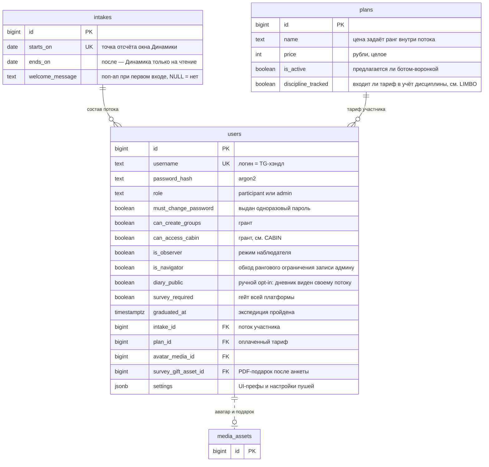
```mermaid
erDiagram
    users {
        bigint id PK
        text username UK "логин = TG-хэндл"
        text password_hash "argon2"
        text role "participant или admin"
        boolean must_change_password "выдан одноразовый пароль"
        boolean can_create_groups "грант"
        boolean can_access_cabin "грант, см. CABIN"
        boolean is_observer "режим наблюдателя"
        boolean is_navigator "обход рангового ограничения записи админу"
        boolean diary_public "ручной opt-in: дневник виден своему потоку"
        boolean survey_required "гейт всей платформы"
        timestamptz graduated_at "экспедиция пройдена"
        bigint intake_id FK "поток участника"
        bigint plan_id FK "оплаченный тариф"
        bigint avatar_media_id FK
        bigint survey_gift_asset_id FK "PDF-подарок после анкеты"
        jsonb settings "UI-префы и настройки пушей"
    }
    intakes {
        bigint id PK
        date starts_on UK "точка отсчёта окна Динамики"
        date ends_on "после — Динамика только на чтение"
        text welcome_message "поп-ап при первом входе, NULL = нет"
    }
    plans {
        bigint id PK
        text name "цена задаёт ранг внутри потока"
        int price "рубли, целое"
        boolean is_active "предлагается ли ботом-воронкой"
        boolean discipline_tracked "входит ли тариф в учёт дисциплины, см. LIMBO"
    }
    media_assets {
        bigint id PK
    }

    intakes ||--o{ users : "состав потока"
    plans ||--o{ users : "тариф участника"
    users ||..o| media_assets : "аватар и подарок"
```

Ранг тарифа считается **по факту, а не по колонке**: `plans` не привязана к `intakes`
FK, «тарифы потока» — это тарифы, которые реально держит хоть кто-то из потока;
ранг 1..N по возрастанию цены, «без тарифа» — ранг 0. Участник ранга R видит контакты
рангом ≤ R своего потока; писать админу могут два самых дорогих тарифа, `is_navigator`
это ограничение снимает точечно. Деактивация тарифа рангов не сбрасывает — `is_active`
управляет только тем, предлагает ли его бот-воронка.

`discipline_tracked` — независимый явный флаг, не выводится из цены/ранга (ранг внутри
потока плавающий): держатели такого тарифа попадают в учёт просрочек Динамики и могут
уйти в Междумирье, см. LIMBO.md.

Истории «был участником прошлого потока» на уровне отдельной таблицы **нет** — доступ
к чужому потоку не архивируется, `intake_id` у пользователя один и живой.

### 2.2. Комнаты и сообщения

Одна таблица `rooms` на три типа пространств; различия — в поведении, не в структуре.
У каналов строк `room_members` для обычных участников **нет** (доступ неявный, строка
создаётся лениво ради курсора прочитанного). Треды плоские: ответ всегда указывает на
корень. Неявная видимость канала фильтруется парой «поток + тариф» (`rooms.intake_id`
и `room_plans`, см. 2.1); новостной канал с ARG-104 тоже привязан к потоку — по одному
на поток, а не один на платформу (`uq_rooms_news_per_intake`). Личный дневник — особый
случай: у самой комнаты `intake_id` не проставляется, сравниваются потоки владельца и
смотрящего. `dm_unlocked_by_admin` снимает разовое ограничение «нельзя писать админу
первым» для ЛС. См. [ROOMS.md](ROOMS.md), [MESSAGES.md](MESSAGES.md).

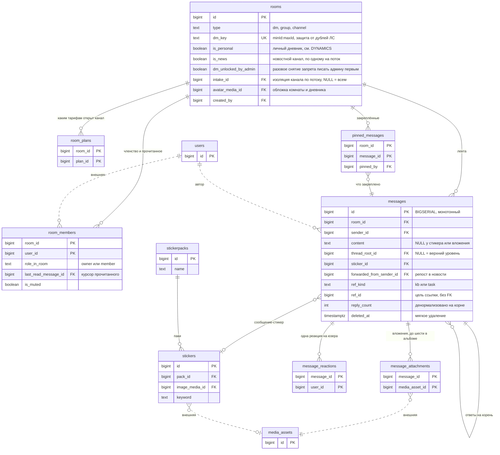
```mermaid
erDiagram
    rooms {
        bigint id PK
        text type "dm, group, channel"
        text dm_key UK "minId:maxId, защита от дублей ЛС"
        boolean is_personal "личный дневник, см. DYNAMICS"
        boolean is_news "новостной канал, по одному на поток"
        boolean dm_unlocked_by_admin "разовое снятие запрета писать админу первым"
        bigint intake_id FK "изоляция канала по потоку, NULL = всем"
        bigint avatar_media_id FK "обложка комнаты и дневника"
        bigint created_by FK
    }
    room_plans {
        bigint room_id PK
        bigint plan_id PK
    }
    room_members {
        bigint room_id PK
        bigint user_id PK
        text role_in_room "owner или member"
        bigint last_read_message_id FK "курсор прочитанного"
        boolean is_muted
    }
    messages {
        bigint id PK "BIGSERIAL, монотонный"
        bigint room_id FK
        bigint sender_id FK
        text content "NULL у стикера или вложения"
        bigint thread_root_id FK "NULL = верхний уровень"
        bigint sticker_id FK
        bigint forwarded_from_sender_id FK "репост в новости"
        text ref_kind "kb или task"
        bigint ref_id "цель ссылки, без FK"
        int reply_count "денормализовано на корне"
        timestamptz deleted_at "мягкое удаление"
    }
    message_attachments {
        bigint message_id PK
        bigint media_asset_id PK
    }
    message_reactions {
        bigint message_id PK
        bigint user_id PK
    }
    pinned_messages {
        bigint room_id PK
        bigint message_id PK
        bigint pinned_by FK
    }
    stickerpacks {
        bigint id PK
        text name
    }
    stickers {
        bigint id PK
        bigint pack_id FK
        bigint image_media_id FK
        text keyword
    }
    users {
        bigint id PK
    }
    media_assets {
        bigint id PK
    }

    rooms ||--o{ room_members : "членство и прочитанное"
    rooms ||--o{ room_plans : "каким тарифам открыт канал"
    rooms ||--o{ messages : "лента"
    rooms ||--o{ pinned_messages : "закреплённые"
    messages ||--o{ messages : "ответы на корень"
    messages ||--o{ message_attachments : "вложения, до шести в альбоме"
    messages ||--o{ message_reactions : "одна реакция на юзера"
    messages }o--o| stickers : "сообщение-стикер"
    stickerpacks ||--o{ stickers : "паки"
    pinned_messages }o--|| messages : "что закреплено"
    users ||..o{ room_members : "внешняя"
    users ||..o{ messages : "автор"
    message_attachments }o..|| media_assets : "внешняя"
    stickers }o..o| media_assets : "внешняя"
```

### 2.3. Медиа

`media_assets` — общий узел: одна таблица метаданных на чат, КБ, задачи, аватары и
стикеры. Байты в MinIO, публичный URL не хранится — он подписывается на каждое чтение
после проверки прав. Видео и аудио проходят один и тот же конвейер транскода (только
без миниатюры у аудио). См. [FILES.md](FILES.md).

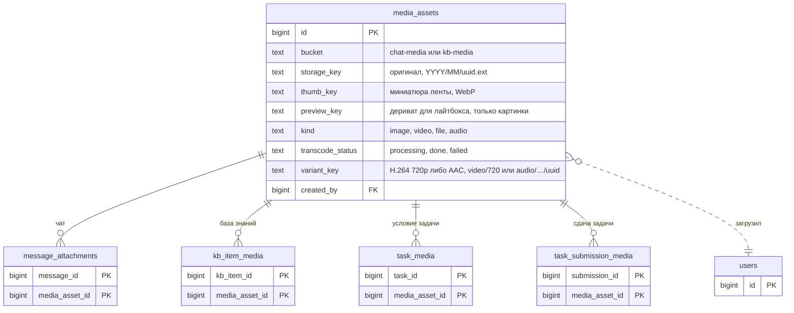
```mermaid
erDiagram
    media_assets {
        bigint id PK
        text bucket "chat-media или kb-media"
        text storage_key "оригинал, YYYY/MM/uuid.ext"
        text thumb_key "миниатюра ленты, WebP"
        text preview_key "дериват для лайтбокса, только картинки"
        text kind "image, video, file, audio"
        text transcode_status "processing, done, failed"
        text variant_key "H.264 720p либо AAC, video/720 или audio/…/uuid"
        bigint created_by FK
    }
    message_attachments {
        bigint message_id PK
        bigint media_asset_id PK
    }
    kb_item_media {
        bigint kb_item_id PK
        bigint media_asset_id PK
    }
    task_media {
        bigint task_id PK
        bigint media_asset_id PK
    }
    task_submission_media {
        bigint submission_id PK
        bigint media_asset_id PK
    }
    users {
        bigint id PK
    }

    media_assets ||--o{ message_attachments : "чат"
    media_assets ||--o{ kb_item_media : "база знаний"
    media_assets ||--o{ task_media : "условие задачи"
    media_assets ||--o{ task_submission_media : "сдача задачи"
    media_assets }o..|| users : "загрузил"
```

### 2.4. База знаний

См. [KB.md](KB.md). `kb_categories` — структура «на вырост», в MVP список плоский.
Видимость материала — та же пара «поток + тариф», что у каналов (`kb_items.intake_id`
и `kb_item_plans`, см. 2.1). Позиция просмотра видео хранится по тройке «материал +
файл + пользователь», чтобы длинный эфир можно было досмотреть с другого устройства.

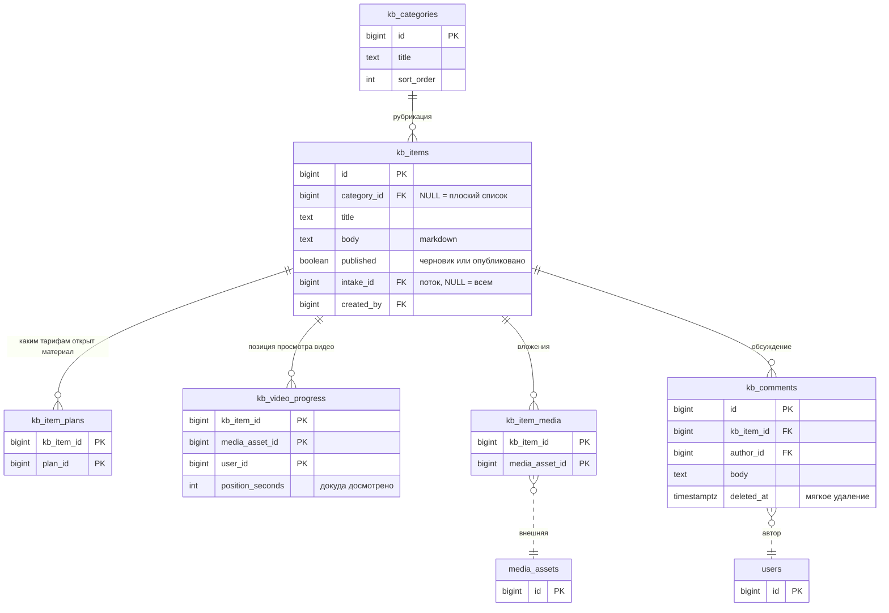
```mermaid
erDiagram
    kb_categories {
        bigint id PK
        text title
        int sort_order
    }
    kb_items {
        bigint id PK
        bigint category_id FK "NULL = плоский список"
        text title
        text body "markdown"
        boolean published "черновик или опубликовано"
        bigint intake_id FK "поток, NULL = всем"
        bigint created_by FK
    }
    kb_item_plans {
        bigint kb_item_id PK
        bigint plan_id PK
    }
    kb_video_progress {
        bigint kb_item_id PK
        bigint media_asset_id PK
        bigint user_id PK
        int position_seconds "докуда досмотрено"
    }
    kb_item_media {
        bigint kb_item_id PK
        bigint media_asset_id PK
    }
    kb_comments {
        bigint id PK
        bigint kb_item_id FK
        bigint author_id FK
        text body
        timestamptz deleted_at "мягкое удаление"
    }
    media_assets {
        bigint id PK
    }
    users {
        bigint id PK
    }

    kb_categories ||--o{ kb_items : "рубрикация"
    kb_items ||--o{ kb_item_plans : "каким тарифам открыт материал"
    kb_items ||--o{ kb_item_media : "вложения"
    kb_items ||--o{ kb_video_progress : "позиция просмотра видео"
    kb_items ||--o{ kb_comments : "обсуждение"
    kb_item_media }o..|| media_assets : "внешняя"
    kb_comments }o..|| users : "автор"
```

### 2.5. Задачи — выдача и сдача

Четыре типа (`common`, `individual`, `pair`, `stream`). Общая часть — назначение,
сдача (история версий), ревью. Дедлайн синхронизируется в календарь, у отдельного
назначения может быть свой `deadline_at`, переопределяющий дедлайн задачи. У
`common`-задачи видимость неявная, поэтому она фильтруется потоком и тарифом
(`tasks.intake_id`, `task_plans`) — на остальные типы фильтр не влияет, назначение
сильнее. См. [TASKS.md](TASKS.md).

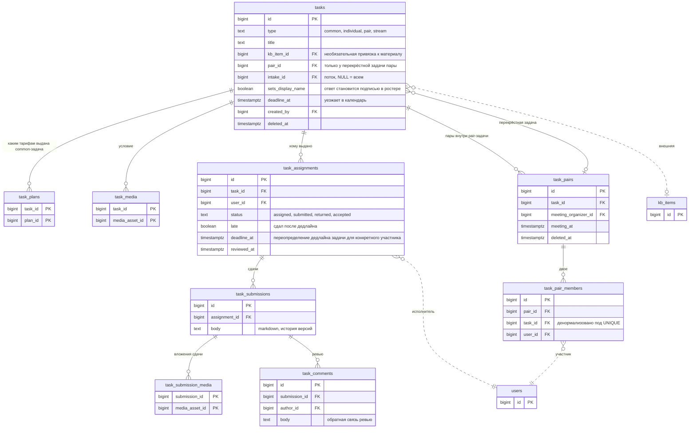
```mermaid
erDiagram
    tasks {
        bigint id PK
        text type "common, individual, pair, stream"
        text title
        bigint kb_item_id FK "необязательная привязка к материалу"
        bigint pair_id FK "только у перекрёстной задачи пары"
        bigint intake_id FK "поток, NULL = всем"
        boolean sets_display_name "ответ становится подписью в ростере"
        timestamptz deadline_at "уезжает в календарь"
        bigint created_by FK
        timestamptz deleted_at
    }
    task_plans {
        bigint task_id PK
        bigint plan_id PK
    }
    task_media {
        bigint task_id PK
        bigint media_asset_id PK
    }
    task_assignments {
        bigint id PK
        bigint task_id FK
        bigint user_id FK
        text status "assigned, submitted, returned, accepted"
        boolean late "сдал после дедлайна"
        timestamptz deadline_at "переопределение дедлайна задачи для конкретного участника"
        timestamptz reviewed_at
    }
    task_submissions {
        bigint id PK
        bigint assignment_id FK
        text body "markdown, история версий"
    }
    task_submission_media {
        bigint submission_id PK
        bigint media_asset_id PK
    }
    task_comments {
        bigint id PK
        bigint submission_id FK
        bigint author_id FK
        text body "обратная связь ревью"
    }
    task_pairs {
        bigint id PK
        bigint task_id FK
        bigint meeting_organizer_id FK
        timestamptz meeting_at
        timestamptz deleted_at
    }
    task_pair_members {
        bigint id PK
        bigint pair_id FK
        bigint task_id FK "денормализовано под UNIQUE"
        bigint user_id FK
    }
    kb_items {
        bigint id PK
    }
    users {
        bigint id PK
    }

    tasks ||--o{ task_plans : "каким тарифам выдана common-задача"
    tasks ||--o{ task_media : "условие"
    tasks ||--o{ task_assignments : "кому выдано"
    task_assignments ||--o{ task_submissions : "сдачи"
    task_submissions ||--o{ task_submission_media : "вложения сдачи"
    task_submissions ||--o{ task_comments : "ревью"
    tasks ||--o{ task_pairs : "пары внутри pair-задачи"
    task_pairs ||--o{ task_pair_members : "двое"
    task_pairs |o--o{ tasks : "перекрёстная задача"
    tasks }o..o| kb_items : "внешняя"
    task_assignments }o..|| users : "исполнитель"
    task_pair_members }o..|| users : "участник"
```

### 2.6. Задачи — поток (турнирная сетка)

`stream`-задача: участники пишут личный текст, объединяются в подгруппы по раундам,
согласовывают одну фразу голосованием и поднимают её вверх по дереву. Прогресс не
хранится — он выводится из данных. `phrase_option_id` на узле — ссылка на победивший
вариант, `position` — только раскладка сетки на экране. См. [TASKS.md](TASKS.md).

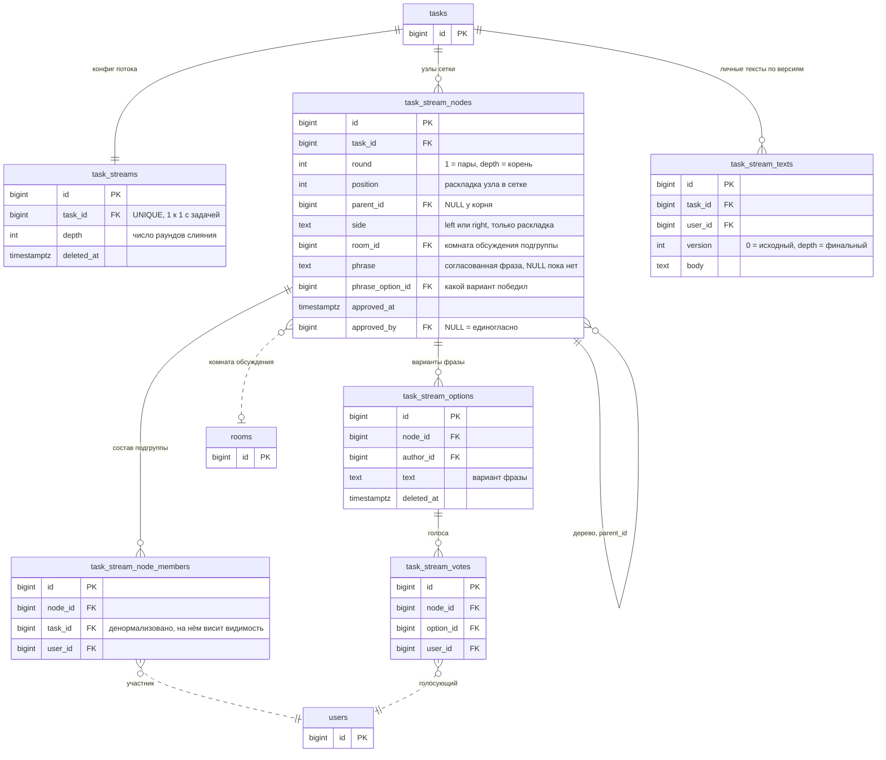
```mermaid
erDiagram
    task_streams {
        bigint id PK
        bigint task_id FK "UNIQUE, 1 к 1 с задачей"
        int depth "число раундов слияния"
        timestamptz deleted_at
    }
    task_stream_nodes {
        bigint id PK
        bigint task_id FK
        int round "1 = пары, depth = корень"
        int position "раскладка узла в сетке"
        bigint parent_id FK "NULL у корня"
        text side "left или right, только раскладка"
        bigint room_id FK "комната обсуждения подгруппы"
        text phrase "согласованная фраза, NULL пока нет"
        bigint phrase_option_id FK "какой вариант победил"
        timestamptz approved_at
        bigint approved_by FK "NULL = единогласно"
    }
    task_stream_node_members {
        bigint id PK
        bigint node_id FK
        bigint task_id FK "денормализовано, на нём висит видимость"
        bigint user_id FK
    }
    task_stream_texts {
        bigint id PK
        bigint task_id FK
        bigint user_id FK
        int version "0 = исходный, depth = финальный"
        text body
    }
    task_stream_options {
        bigint id PK
        bigint node_id FK
        bigint author_id FK
        text text "вариант фразы"
        timestamptz deleted_at
    }
    task_stream_votes {
        bigint id PK
        bigint node_id FK
        bigint option_id FK
        bigint user_id FK
    }
    tasks {
        bigint id PK
    }
    rooms {
        bigint id PK
    }
    users {
        bigint id PK
    }

    tasks ||--|| task_streams : "конфиг потока"
    tasks ||--o{ task_stream_nodes : "узлы сетки"
    task_stream_nodes ||--o{ task_stream_nodes : "дерево, parent_id"
    task_stream_nodes ||--o{ task_stream_node_members : "состав подгруппы"
    task_stream_nodes ||--o{ task_stream_options : "варианты фразы"
    task_stream_options ||--o{ task_stream_votes : "голоса"
    tasks ||--o{ task_stream_texts : "личные тексты по версиям"
    task_stream_nodes }o..o| rooms : "комната обсуждения"
    task_stream_node_members }o..|| users : "участник"
    task_stream_votes }o..|| users : "голосующий"
```

### 2.7. Динамика (журнал)

Записей журнала как таблицы **нет**: запись дня — это `messages` в личной комнате
(`rooms.is_personal`). В базе живут только версионируемая **структура** задания,
самопрощения и админские зачёты. Окно 28 дней отсчитывается от `intakes.starts_on`
потока участника (см. 2.1), а после `intakes.ends_on` Динамика закрытого потока
доступна только на чтение. См. [DYNAMICS.md](DYNAMICS.md).

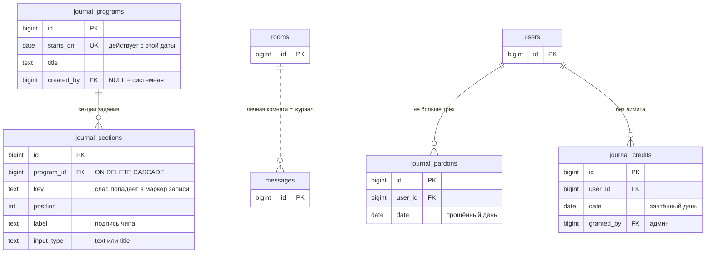
```mermaid
erDiagram
    journal_programs {
        bigint id PK
        date starts_on UK "действует с этой даты"
        text title
        bigint created_by FK "NULL = системная"
    }
    journal_sections {
        bigint id PK
        bigint program_id FK "ON DELETE CASCADE"
        text key "слаг, попадает в маркер записи"
        int position
        text label "подпись чипа"
        text input_type "text или title"
    }
    journal_pardons {
        bigint id PK
        bigint user_id FK
        date date "прощённый день"
    }
    journal_credits {
        bigint id PK
        bigint user_id FK
        date date "зачтённый день"
        bigint granted_by FK "админ"
    }
    rooms {
        bigint id PK
    }
    messages {
        bigint id PK
    }
    users {
        bigint id PK
    }

    journal_programs ||--o{ journal_sections : "секции задания"
    users ||--o{ journal_pardons : "не больше трёх"
    users ||--o{ journal_credits : "без лимита"
    rooms ||..o{ messages : "личная комната = журнал"
```

### 2.8. Уведомления и push

Одна точка генерации, два транспорта: строка в Postgres для ленты колокольчика и
WS-событие в личный канал `user:{id}`, плюс, если разрешено настройками, нативный
Web Push. Строки не удаляются, но лента показывает прочитанное не старше 48 часов —
ретенция на чтении (`READ_FEED_RETENTION`), а не в базе. `journal_missed` больше не
генерируется новым кодом, но значение остаётся в CHECK-констрейнте ради старых строк.
См. [NOTIFICATIONS.md](NOTIFICATIONS.md).

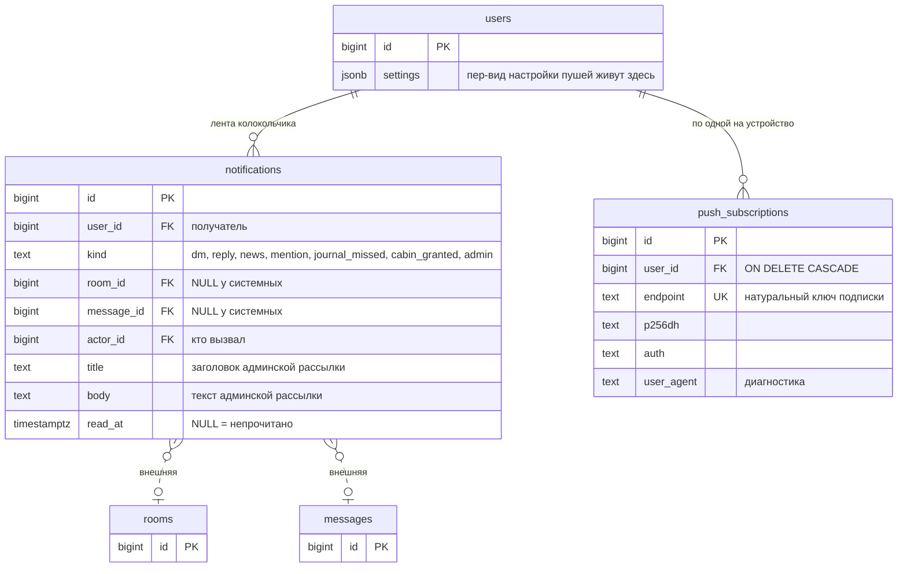
```mermaid
erDiagram
    notifications {
        bigint id PK
        bigint user_id FK "получатель"
        text kind "dm, reply, news, mention, journal_missed, cabin_granted, admin"
        bigint room_id FK "NULL у системных"
        bigint message_id FK "NULL у системных"
        bigint actor_id FK "кто вызвал"
        text title "заголовок админской рассылки"
        text body "текст админской рассылки"
        timestamptz read_at "NULL = непрочитано"
    }
    push_subscriptions {
        bigint id PK
        bigint user_id FK "ON DELETE CASCADE"
        text endpoint UK "натуральный ключ подписки"
        text p256dh
        text auth
        text user_agent "диагностика"
    }
    users {
        bigint id PK
        jsonb settings "пер-вид настройки пушей живут здесь"
    }
    rooms {
        bigint id PK
    }
    messages {
        bigint id PK
    }

    users ||--o{ notifications : "лента колокольчика"
    users ||--o{ push_subscriptions : "по одной на устройство"
    notifications }o..o| rooms : "внешняя"
    notifications }o..o| messages : "внешняя"
```

### 2.9. Каюта, анкета, поддержка, календарь

Четыре небольших независимых области. У каюты и анкеты форма живёт в коде, ответы —
в JSONB. Каюта — единственное место с **жёстким** удалением. Событие календаря
изолируется потоком и тарифом (`intake_id` + `calendar_event_plans`), а не привязкой к
комнате: прежняя колонка `room_id` из модели убрана (в базе она ещё жива по правилу
expand/contract, дропать её отдельным релизом). См. [CABIN.md](CABIN.md),
[SURVEY.md](SURVEY.md), [SUPPORT.md](SUPPORT.md), [CALENDAR.md](CALENDAR.md).

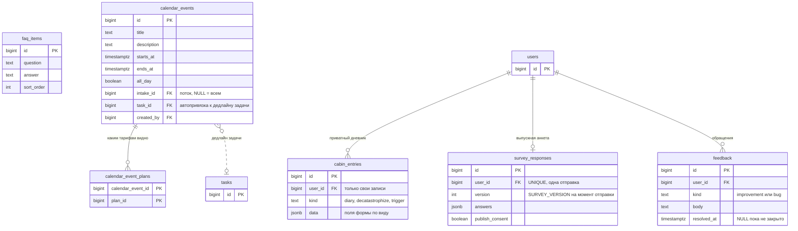
```mermaid
erDiagram
    cabin_entries {
        bigint id PK
        bigint user_id FK "только свои записи"
        text kind "diary, decatastrophize, trigger"
        jsonb data "поля формы по виду"
    }
    survey_responses {
        bigint id PK
        bigint user_id FK "UNIQUE, одна отправка"
        int version "SURVEY_VERSION на момент отправки"
        jsonb answers
        boolean publish_consent
    }
    feedback {
        bigint id PK
        bigint user_id FK
        text kind "improvement или bug"
        text body
        timestamptz resolved_at "NULL пока не закрыто"
    }
    faq_items {
        bigint id PK
        text question
        text answer
        int sort_order
    }
    calendar_events {
        bigint id PK
        text title
        text description
        timestamptz starts_at
        timestamptz ends_at
        boolean all_day
        bigint intake_id FK "поток, NULL = всем"
        bigint task_id FK "автопривязка к дедлайну задачи"
        bigint created_by FK
    }
    calendar_event_plans {
        bigint calendar_event_id PK
        bigint plan_id PK
    }
    users {
        bigint id PK
    }
    tasks {
        bigint id PK
    }

    users ||--o{ cabin_entries : "приватный дневник"
    users ||--o| survey_responses : "выпускная анкета"
    users ||--o{ feedback : "обращения"
    calendar_events ||--o{ calendar_event_plans : "каким тарифам видно"
    calendar_events }o..o| tasks : "дедлайн задачи"
```

### 2.10. Круг Экспедиции

Расписание потока: шесть этапов (Точка Баланса → Воздух → Огонь → Вода → Земля →
Финал), каждый открывается эфиром. Длина этапа не хранится — считается из дат соседей.
Четыре стихии несут по «замку»: слот, куда участник вводит выпавшую ему гексаграмму, а
раскрывает его сдача привязанного к этапу задания. Контент Генных Ключей —
не в базе, он поставляется с фронтендом. См. [EXPEDITION.md](EXPEDITION.md),
[GENE_KEYS.md](GENE_KEYS.md).

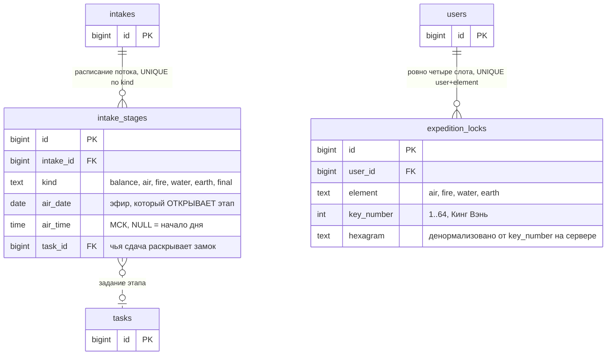
```mermaid
erDiagram
    intake_stages {
        bigint id PK
        bigint intake_id FK
        text kind "balance, air, fire, water, earth, final"
        date air_date "эфир, который ОТКРЫВАЕТ этап"
        time air_time "МСК, NULL = начало дня"
        bigint task_id FK "чья сдача раскрывает замок"
    }
    expedition_locks {
        bigint id PK
        bigint user_id FK
        text element "air, fire, water, earth"
        int key_number "1..64, Кинг Вэнь"
        text hexagram "денормализовано от key_number на сервере"
    }
    intakes {
        bigint id PK
    }
    tasks {
        bigint id PK
    }
    users {
        bigint id PK
    }

    intakes ||--o{ intake_stages : "расписание потока, UNIQUE по kind"
    intake_stages }o..o| tasks : "задание этапа"
    users ||--o{ expedition_locks : "ровно четыре слота, UNIQUE user+element"
```

### 2.11. Приём: воронка бота

Состояние воронки — в Postgres, одна строка на Telegram-чат: она обязана пережить
рестарт контейнера. Статусы идут строго по порядку; «Задать вопрос» статус не меняет.
Часы брони тикают только на шагах выбора тарифа / оферты / чека — на `payment_review`
ход админа, и заявка там не сгорает. Цена фиксируется снимком в момент «Принять»:
до этого бот читал `plans.price` вживую, и админская правка тарифа молча долетала до
уже забронировавшего человека. См. [INTAKE_BOT.md](INTAKE_BOT.md).

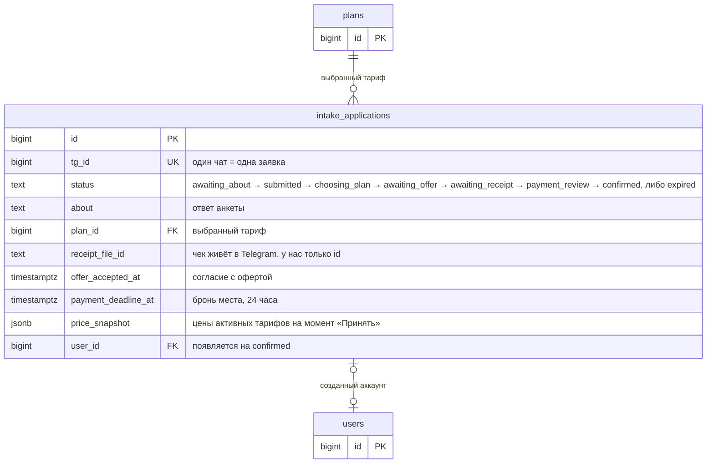
```mermaid
erDiagram
    intake_applications {
        bigint id PK
        bigint tg_id UK "один чат = одна заявка"
        text status "awaiting_about → submitted → choosing_plan → awaiting_offer → awaiting_receipt → payment_review → confirmed, либо expired"
        text about "ответ анкеты"
        bigint plan_id FK "выбранный тариф"
        text receipt_file_id "чек живёт в Telegram, у нас только id"
        timestamptz offer_accepted_at "согласие с офертой"
        timestamptz payment_deadline_at "бронь места, 24 часа"
        jsonb price_snapshot "цены активных тарифов на момент «Принять»"
        bigint user_id FK "появляется на confirmed"
    }
    plans {
        bigint id PK
    }
    users {
        bigint id PK
    }

    plans ||--o{ intake_applications : "выбранный тариф"
    intake_applications |o--o| users : "созданный аккаунт"
```

---

## 3. Ключевые потоки

### 3.1. Вход и обновление токена

Access-токен stateless, refresh — с `jti` в whitelist Redis, поэтому его можно
отозвать. На `/refresh` работает **ротация**: предъявленный `jti` гасится, выдаётся
новая пара. См. [AUTH.md](AUTH.md).

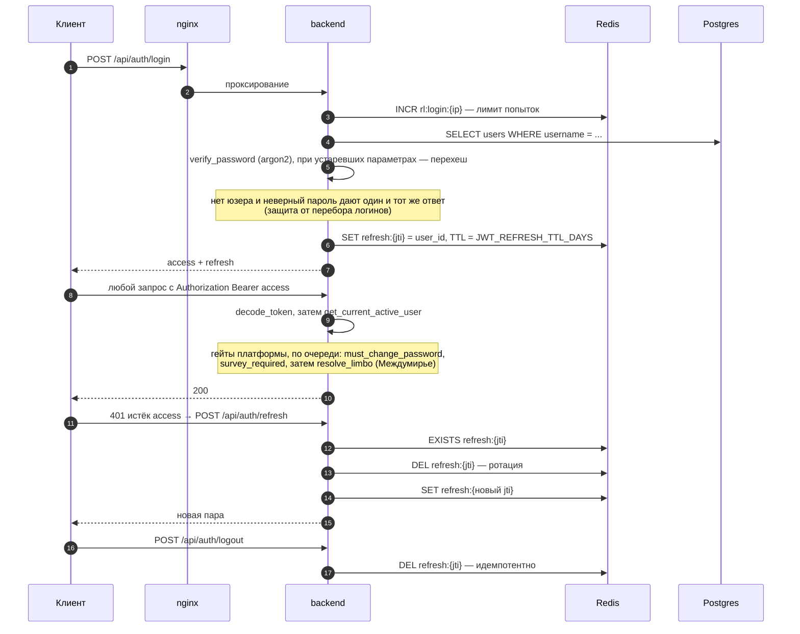
```mermaid
sequenceDiagram
    autonumber
    participant C as Клиент
    participant N as nginx
    participant A as backend
    participant R as Redis
    participant P as Postgres

    C->>N: POST /api/auth/login
    N->>A: проксирование
    A->>R: INCR rl:login:{ip} — лимит попыток
    A->>P: SELECT users WHERE username = ...
    A->>A: verify_password (argon2), при устаревших параметрах — перехеш
    Note over A: нет юзера и неверный пароль дают один и тот же ответ<br/>(защита от перебора логинов)
    A->>R: SET refresh:{jti} = user_id, TTL = JWT_REFRESH_TTL_DAYS
    A-->>C: access + refresh

    C->>A: любой запрос с Authorization Bearer access
    A->>A: decode_token, затем get_current_active_user
    Note over A: гейты платформы, по очереди: must_change_password,<br/>survey_required, затем resolve_limbo (Междумирье)
    A-->>C: 200

    C->>A: 401 истёк access → POST /api/auth/refresh
    A->>R: EXISTS refresh:{jti}
    A->>R: DEL refresh:{jti} — ротация
    A->>R: SET refresh:{новый jti}
    A-->>C: новая пара

    C->>A: POST /api/auth/logout
    A->>R: DEL refresh:{jti} — идемпотентно
```

### 3.2. Отправка сообщения

Ключевое правило: **сайд-эффекты только после commit**. Публикация в WS до коммита —
это «отправлено, но потерялось»: подписчики уже увидели сообщение, а транзакция
откатилась. Хуки регистрируются через `after_commit()` (`app/db/session.py`) и
выполняются строго после успешного `commit`.

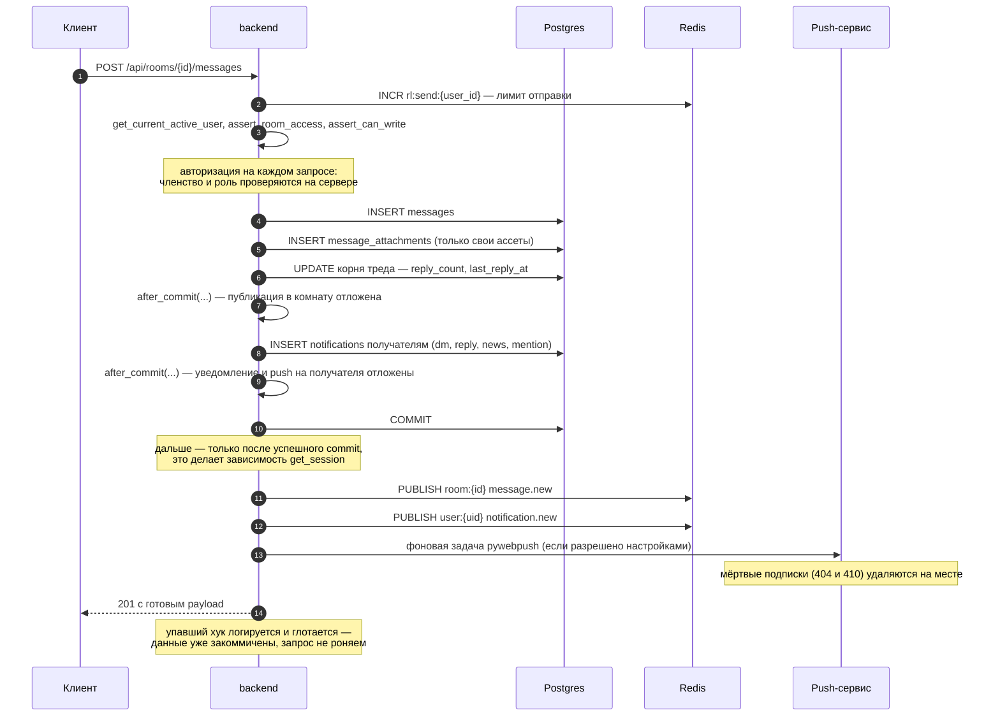
```mermaid
sequenceDiagram
    autonumber
    participant C as Клиент
    participant A as backend
    participant P as Postgres
    participant R as Redis
    participant W as Push-сервис

    C->>A: POST /api/rooms/{id}/messages
    A->>R: INCR rl:send:{user_id} — лимит отправки
    A->>A: get_current_active_user, assert_room_access, assert_can_write
    Note over A: авторизация на каждом запросе:<br/>членство и роль проверяются на сервере
    A->>P: INSERT messages
    A->>P: INSERT message_attachments (только свои ассеты)
    A->>P: UPDATE корня треда — reply_count, last_reply_at
    A->>A: after_commit(...) — публикация в комнату отложена
    A->>P: INSERT notifications получателям (dm, reply, news, mention)
    A->>A: after_commit(...) — уведомление и push на получателя отложены
    A->>P: COMMIT

    Note over A: дальше — только после успешного commit,<br/>это делает зависимость get_session
    A->>R: PUBLISH room:{id} message.new
    A->>R: PUBLISH user:{uid} notification.new
    A->>W: фоновая задача pywebpush (если разрешено настройками)
    Note over W: мёртвые подписки (404 и 410) удаляются на месте
    A-->>C: 201 с готовым payload
    Note over A: упавший хук логируется и глотается —<br/>данные уже закоммичены, запрос не роняем
```

### 3.3. Загрузка файла

Три шага, байты идут мимо FastAPI. Между шагами живёт **намерение загрузки** в Redis
(TTL = `PRESIGN_EXPIRES`, 1 час) — им же сервер проверяет, что подтверждают именно то,
что разрешили. Размер берётся из MinIO, клиенту не верим. Видео и аудио уходят в один и
тот же фоновый транскод. См. [FILES.md](FILES.md).

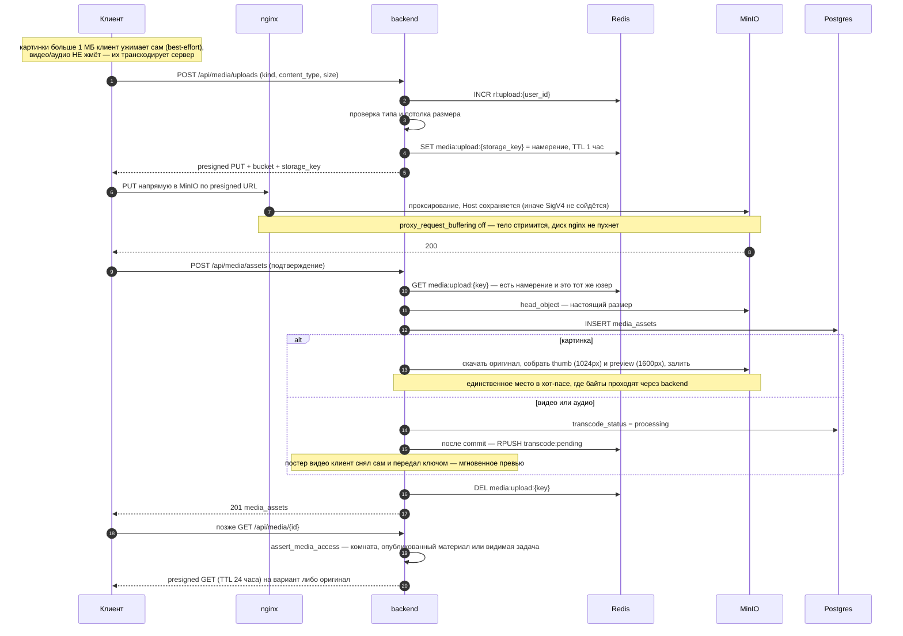
```mermaid
sequenceDiagram
    autonumber
    participant C as Клиент
    participant N as nginx
    participant A as backend
    participant R as Redis
    participant M as MinIO
    participant P as Postgres

    Note over C: картинки больше 1 МБ клиент ужимает сам (best-effort),<br/>видео/аудио НЕ жмёт — их транскодирует сервер

    C->>A: POST /api/media/uploads (kind, content_type, size)
    A->>R: INCR rl:upload:{user_id}
    A->>A: проверка типа и потолка размера
    A->>R: SET media:upload:{storage_key} = намерение, TTL 1 час
    A-->>C: presigned PUT + bucket + storage_key

    C->>N: PUT напрямую в MinIO по presigned URL
    N->>M: проксирование, Host сохраняется (иначе SigV4 не сойдётся)
    Note over N,M: proxy_request_buffering off — тело стримится, диск nginx не пухнет
    M-->>C: 200

    C->>A: POST /api/media/assets (подтверждение)
    A->>R: GET media:upload:{key} — есть намерение и это тот же юзер
    A->>M: head_object — настоящий размер
    A->>P: INSERT media_assets
    alt картинка
        A->>M: скачать оригинал, собрать thumb (1024px) и preview (1600px), залить
        Note over A,M: единственное место в хот-пасе, где байты проходят через backend
    else видео или аудио
        A->>P: transcode_status = processing
        A->>R: после commit — RPUSH transcode:pending
        Note over A: постер видео клиент снял сам и передал ключом — мгновенное превью
    end
    A->>R: DEL media:upload:{key}
    A-->>C: 201 media_assets

    C->>A: позже GET /api/media/{id}
    A->>A: assert_media_access — комната, опубликованный материал или видимая задача
    A-->>C: presigned GET (TTL 24 часа) на вариант либо оригинал
```

### 3.4. Доставка событий реального времени

WS-соединение аутентифицируется в рукопожатии (токен в query — браузер не шлёт
заголовки на WS), подписка на комнату проверяется отдельно. При коннекте фиксируется
статус «дешёвый тариф» участника — от него зависит, какой вариант контента сообщения
уйдёт именно этому соединению (редакция контента, ARG-115). Между процессами и цветами
события ходят через Redis pub/sub, поэтому «кто опубликовал» и «у кого сокет» могут
быть разными процессами. См. [MESSAGES.md](MESSAGES.md).

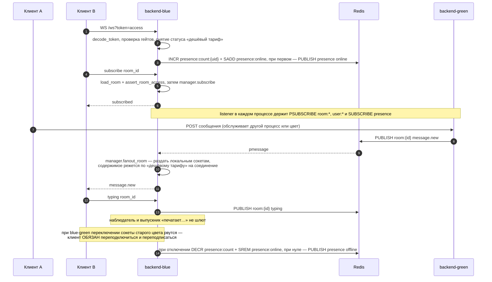
```mermaid
sequenceDiagram
    autonumber
    participant C1 as Клиент A
    participant C2 as Клиент B
    participant BB as backend-blue
    participant R as Redis
    participant BG as backend-green

    C2->>BB: WS /ws?token=access
    BB->>BB: decode_token, проверка гейтов, снятие статуса «дешёвый тариф»
    BB->>R: INCR presence:count:{uid} + SADD presence:online, при первом — PUBLISH presence online
    C2->>BB: subscribe room_id
    BB->>BB: load_room + assert_room_access, затем manager.subscribe
    BB-->>C2: subscribed

    Note over BB,BG: listener в каждом процессе держит PSUBSCRIBE room:*, user:* и SUBSCRIBE presence

    C1->>BG: POST сообщения (обслуживает другой процесс или цвет)
    BG->>R: PUBLISH room:{id} message.new
    R-->>BB: pmessage
    BB->>BB: manager.fanout_room — раздать локальным сокетам,<br/>содержимое режется по «дешёвому тарифу» на соединение
    BB-->>C2: message.new

    C2->>BB: typing room_id
    BB->>R: PUBLISH room:{id} typing
    Note over BB: наблюдатель и выпускник «печатает…» не шлют

    Note over C2,BB: при blue-green переключении сокеты старого цвета рвутся —<br/>клиент ОБЯЗАН переподключиться и переподписаться
    BB->>R: при отключении DECR presence:count + SREM presence:online, при нуле — PUBLISH presence offline
```

Каналы шины: `room:{id}` (события комнаты), `user:{id}` (персональные уведомления),
`presence` (широковещательно). Ошибка публикации проглатывается — REST-ответ из-за
недоступного Redis не падает.

### 3.5. Обработка видео и аудио

Очередь — простой list в Redis с claim/ack и реклеймом по таймауту. Долговечное
состояние отдачи (`processing` / `done` / `failed`) живёт в Postgres, механика
(pending / inflight / attempts) — только в Redis. Один и тот же цикл воркера
обслуживает оба типа — выбор функции транскода зависит от `media_assets.kind`.
См. [FILES.md](FILES.md).

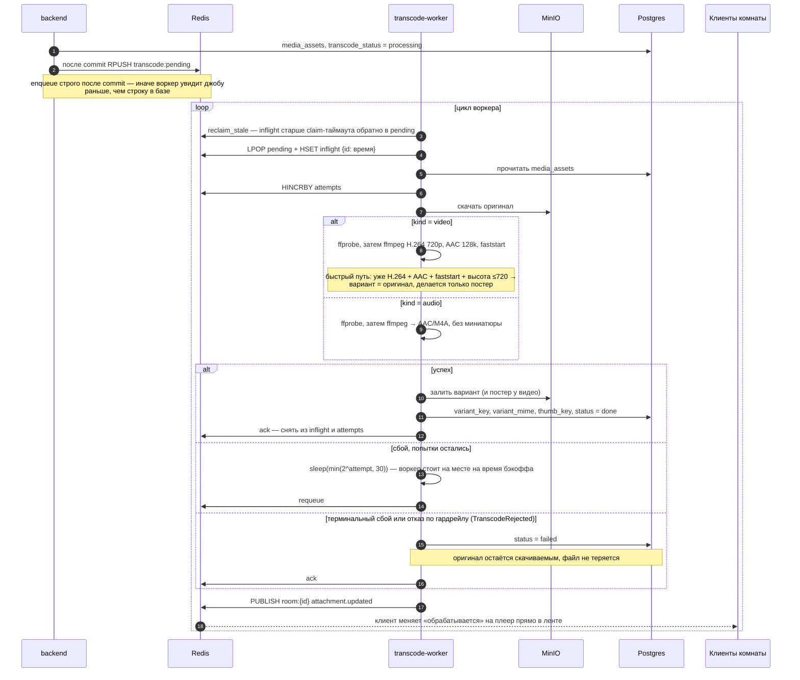
```mermaid
sequenceDiagram
    autonumber
    participant A as backend
    participant R as Redis
    participant T as transcode-worker
    participant M as MinIO
    participant P as Postgres
    participant C as Клиенты комнаты

    A->>P: media_assets, transcode_status = processing
    A->>R: после commit RPUSH transcode:pending
    Note over A,R: enqueue строго после commit — иначе воркер увидит джобу<br/>раньше, чем строку в базе

    loop цикл воркера
        T->>R: reclaim_stale — inflight старше claim-таймаута обратно в pending
        T->>R: LPOP pending + HSET inflight {id: время}
        T->>P: прочитать media_assets
        T->>R: HINCRBY attempts
        T->>M: скачать оригинал
        alt kind = video
            T->>T: ffprobe, затем ffmpeg H.264 720p, AAC 128k, faststart
            Note over T: быстрый путь: уже H.264 + AAC + faststart + высота ≤720 →<br/>вариант = оригинал, делается только постер
        else kind = audio
            T->>T: ffprobe, затем ffmpeg → AAC/M4A, без миниатюры
        end
        alt успех
            T->>M: залить вариант (и постер у видео)
            T->>P: variant_key, variant_mime, thumb_key, status = done
            T->>R: ack — снять из inflight и attempts
        else сбой, попытки остались
            T->>T: sleep(min(2^attempt, 30)) — воркер стоит на месте на время бэкоффа
            T->>R: requeue
        else терминальный сбой или отказ по гардрейлу (TranscodeRejected)
            T->>P: status = failed
            Note over T,P: оригинал остаётся скачиваемым, файл не теряется
            T->>R: ack
        end
        T->>R: PUBLISH room:{id} attachment.updated
        R-->>C: клиент меняет «обрабатывается» на плеер прямо в ленте
    end
```

Гардрейлы связаны между собой: `TRANSCODE_MAX_SOURCE_BYTES` (4 ГБ) и
`TRANSCODE_MAX_DURATION_SECONDS` (3 часа) должны укладываться в
`TRANSCODE_FFMPEG_TIMEOUT_SECONDS` (90 минут), а `TRANSCODE_CLAIM_TIMEOUT_SECONDS`
(2 часа) обязан быть **выше** таймаута ffmpeg — иначе живую джобу отберут у работающего
воркера и работа продублируется. Backoff между попытками синхронный (воркер спит внутри
цикла, а не откладывает джобу в очереди) — при долгом бэкоффе весь воркер простаивает,
т.к. он один. Событие `attachment.updated` летит только в чат: у задач и КБ нет
room-канала, там вариант подхватится при следующем чтении.

### 3.6. Приём в поток (бот-воронка)

Единственный путь на платформу: аккаунтов с самостоятельной регистрацией нет, участника
заводит бот в момент подтверждения оплаты. Два ручных шага админа («Принять» и
«Подтвердить оплату») специально не автоматизированы — платёжный провайдер не
подключён, чек человек присылает картинкой. См. [INTAKE_BOT.md](INTAKE_BOT.md).

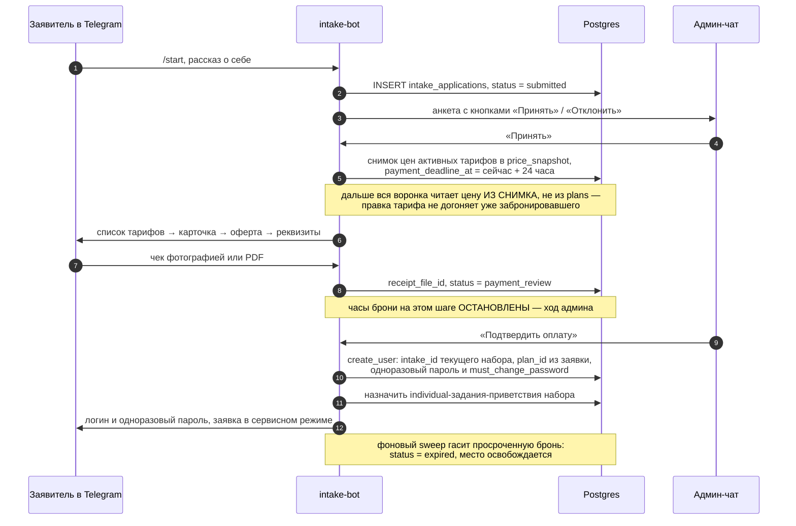
```mermaid
sequenceDiagram
    autonumber
    participant U as Заявитель в Telegram
    participant IB as intake-bot
    participant P as Postgres
    participant AD as Админ-чат

    U->>IB: /start, рассказ о себе
    IB->>P: INSERT intake_applications, status = submitted
    IB->>AD: анкета с кнопками «Принять» / «Отклонить»

    AD->>IB: «Принять»
    IB->>P: снимок цен активных тарифов в price_snapshot,<br/>payment_deadline_at = сейчас + 24 часа
    Note over IB,P: дальше вся воронка читает цену ИЗ СНИМКА, не из plans —<br/>правка тарифа не догоняет уже забронировавшего
    IB->>U: список тарифов → карточка → оферта → реквизиты
    U->>IB: чек фотографией или PDF
    IB->>P: receipt_file_id, status = payment_review
    Note over IB,P: часы брони на этом шаге ОСТАНОВЛЕНЫ — ход админа

    AD->>IB: «Подтвердить оплату»
    IB->>P: create_user: intake_id текущего набора, plan_id из заявки,<br/>одноразовый пароль и must_change_password
    IB->>P: назначить individual-задания-приветствия набора
    IB->>U: логин и одноразовый пароль, заявка в сервисном режиме

    Note over IB,P: фоновый sweep гасит просроченную бронь:<br/>status = expired, место освобождается
```

---

## 4. Окружения и выкладка

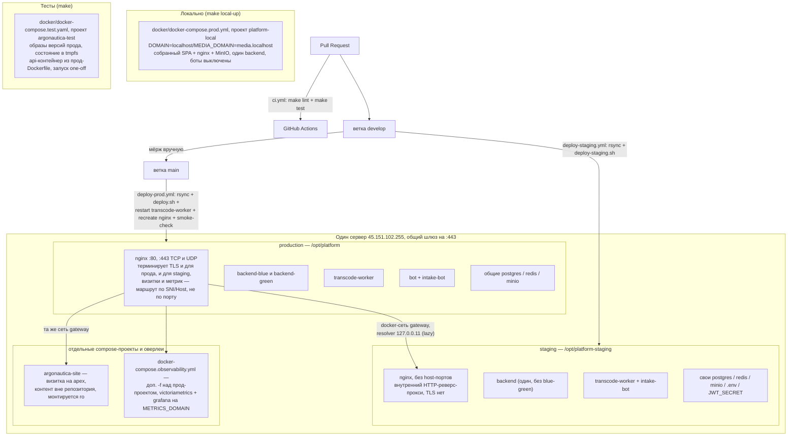
```mermaid
flowchart TB
    subgraph dev["Локально (make local-up)"]
        DC["docker/docker-compose.prod.yml, проект platform-local<br/>DOMAIN=localhost/MEDIA_DOMAIN=media.localhost<br/>собранный SPA + nginx + MinIO, один backend, боты выключены"]
    end

    subgraph tst["Тесты (make)"]
        TC["docker/docker-compose.test.yaml, проект argonautica-test<br/>образы версий прода, состояние в tmpfs<br/>api-контейнер из прод-Dockerfile, запуск one-off"]
    end

    subgraph srv["Один сервер 45.151.102.255, общий шлюз на :443"]
        subgraph prd["production — /opt/platform"]
            PN["nginx :80, :443 TCP и UDP<br/>терминирует TLS и для прода, и для staging,<br/>визитки и метрик — маршрут по SNI/Host, не по порту"]
            PB["backend-blue и backend-green"]
            PW["transcode-worker"]
            PBot["bot + intake-bot"]
            PS["общие postgres / redis / minio"]
        end
        subgraph stg["staging — /opt/platform-staging"]
            SN["nginx, без host-портов<br/>внутренний HTTP-реверс-прокси, TLS нет"]
            SB["backend (один, без blue-green)"]
            SW["transcode-worker + intake-bot"]
            SS["свои postgres / redis / minio / .env / JWT_SECRET"]
        end
        subgraph aside["отдельные compose-проекты и оверлеи"]
            ST["argonautica-site — визитка на apex,<br/>контент вне репозитория, монтируется ro"]
            OB["docker-compose.observability.yml —<br/>доп. -f над прод-проектом, victoriametrics + grafana на METRICS_DOMAIN"]
        end
    end

    PN -->|"docker-сеть gateway,<br/>resolver 127.0.0.11 (lazy)"| SN
    PN -->|"та же сеть gateway"| ST
    PN --> OB

    PR["Pull Request"] -->|"ci.yml: make lint + make test"| CI["GitHub Actions"]
    DEV["ветка develop"] -->|"deploy-staging.yml: rsync + deploy-staging.sh"| stg
    MAIN["ветка main"] -->|"deploy-prod.yml: rsync + deploy.sh +<br/>restart transcode-worker + recreate nginx + smoke-check"| prd
    PR --> DEV
    DEV -->|"мёрж вручную"| MAIN
```

**Blue-green (**`docker/deploy.sh`**)** — по шагам:

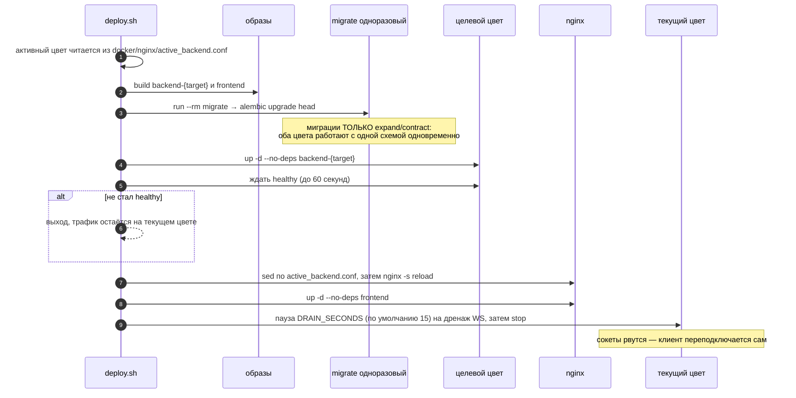
```mermaid
sequenceDiagram
    autonumber
    participant D as deploy.sh
    participant B as образы
    participant Mg as migrate одноразовый
    participant T as целевой цвет
    participant N as nginx
    participant O as текущий цвет

    D->>D: активный цвет читается из docker/nginx/active_backend.conf
    D->>B: build backend-{target} и frontend
    D->>Mg: run --rm migrate → alembic upgrade head
    Note over Mg: миграции ТОЛЬКО expand/contract:<br/>оба цвета работают с одной схемой одновременно
    D->>T: up -d --no-deps backend-{target}
    D->>T: ждать healthy (до 60 секунд)
    alt не стал healthy
        D-->>D: выход, трафик остаётся на текущем цвете
    end
    D->>N: sed по active_backend.conf, затем nginx -s reload
    D->>N: up -d --no-deps frontend
    D->>O: пауза DRAIN_SECONDS (по умолчанию 15) на дренаж WS, затем stop
    Note over O: сокеты рвутся — клиент переподключается сам
```

**Чего сам** `deploy.sh` **НЕ делает** — и кто это закрывает на проде:

| Не делается | Почему | Кто закрывает |
| -- | -- | -- |
| Не перезапускает `transcode-worker` | singleton вне blue-green, скрипт его не трогает — без этого воркер крутит старый образ, а видео/аудио **молча** копятся в очереди и отдаётся оригинал | `deploy-prod.yml`, отдельным шагом сразу после скрипта; шаг роняет деплой, если контейнер не поднялся |
| Не пересоздаёт nginx | `nginx -s reload` не только не перечитывает шаблон (`envsubst` рендерит его лишь при старте контейнера) — он ещё и не обновляет закэшированные IP апстримов. Новый цвет поднимается с новым IP, и nginx после переключения продолжает стучаться в мёртвый контейнер: 502 на весь `/api/` и `/ws` при КАЖДОМ выкате | `deploy-prod.yml`, `--force-recreate nginx` + smoke-check через периметр, тем же шагом |
| Не трогает `bot` и `intake-bot` | singleton'ы на long-polling; второй поллер на том же токене подрался бы за `getUpdates` | никто — перезапуск всегда осознанный вручную |
| Не поднимает визитку и наблюдаемость | это чужие по жизненному циклу compose-сущности (`-p argonautica-site` — отдельный проект; observability — доп. `-f` над прод-проектом), выкат платформы их намеренно не касается | `deploy-prod.yml` отдельным шагом проверяет, что визитка поднята; метрики — вручную |

На staging проще: `deploy-staging.sh` делает `up -d` всему проекту сразу (поэтому
`transcode-worker` и `intake-bot` там обновляются сами) и `--force-recreate nginx`;
бота доступа/поддержки на стенде нет вовсе.

Прочее по окружениям: `MINIO_ENDPOINT` (внутренний) и `MINIO_PUBLIC_ENDPOINT`
(которым подписываются presigned-URL) в проде — **разные** адреса; staging сидит за тем
же шлюзом на стандартном `:443` (не на отдельном порту), поэтому его
`MINIO_PUBLIC_ENDPOINT` порт не несёт. Подробности, сертификаты, HTTP/3, метрики и
бэкапы — в [DEPLOY.md](DEPLOY.md).

---

## Как это поддерживать

* Схема правится **в той же задаче, что и код**. Это уже действующее правило CLAUDE.md:
  изменение, меняющее описанное в `docs/`, обязано обновить соответствующий файл в том же
  изменении — этот файл входит в `docs/`.
* Что именно требует правки здесь:
  * новая таблица или новая связь → соответствующий `erDiagram` в разделе 2;
  * новый сервис или новая интеграция → флоучарт стека в разделе 1;
  * изменение порядка шагов в потоке (особенно вокруг `after_commit`, presigned-URL,
    pub/sub или очереди) → соответствующий `sequenceDiagram` в разделе 3;
  * изменение `docker/deploy.sh`, compose-файлов или того, что деплой не делает
    автоматически → раздел 4.
* Колонки сюда **не переносятся**. Если тянет уточнить тип или ограничение — место для
  этого [DATA_MODEL.md](DATA_MODEL.md), иначе через месяц здесь будет вторая, расходящаяся
  правда.
* Схемы — Mermaid в тексте: рендерятся в GitHub и Linear, диффятся построчно, не устаревают
  как экспортированные картинки.
